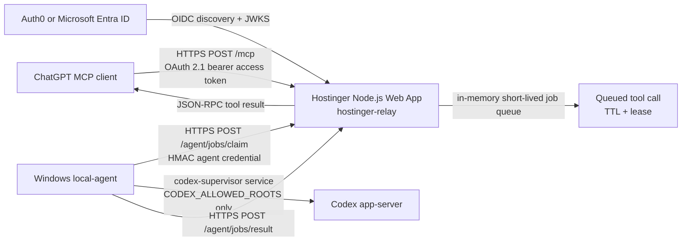

# Hostinger Relay Deployment

This deployment exposes the remote MCP endpoint at:

```text
https://mcp.biotele.mx/mcp
```

DNS and hosting stay at Hostinger. Do not use Cloudflare, do not open router
ports, and do not expose the Windows machine directly.

## Architecture



The Hostinger app validates OAuth bearer JWTs for ChatGPT-facing `/mcp`
requests, validates HMAC signatures only for local-agent routes, rate-limits,
queues work, and returns completed tool results. It never starts Codex, never
reads repositories, and never accesses Windows files.

The Windows local-agent never listens on a port. It connects outbound only to
`https://mcp.biotele.mx`, validates requested `cwd` values against
`CODEX_ALLOWED_ROOTS`, invokes the existing supervisor service, then uploads
results or errors.

## Components

- `src/hostinger-relay.mjs`: Hostinger Node.js Web App entrypoint.
- `src/local-agent.mjs`: outbound-only Windows worker.
- `src/oauth-resource-server.mjs`: OAuth bearer JWT validation, OIDC discovery,
  JWKS caching, and protected-resource metadata.
- `src/relay-auth.mjs`: agent-only HMAC signing, timestamp, nonce, and expiry checks.
- `src/relay-queue.mjs`: short-lived in-memory queue with leases.
- `scripts/install-local-agent.ps1`: Windows user-environment and scheduled-task helper.

## Hostinger hPanel Deployment

1. In Hostinger hPanel, create or select the hosting plan for `biotele.mx`.
2. Open `Websites` > `biotele.mx` > `Advanced` > `Node.js`.
3. Create a new Node.js application for the MCP subdomain, not the existing
   public website path.
4. Choose Node.js `22` or `24`.
5. Set the startup command to:

```text
npm run start:hostinger-relay
```

6. Set the app root to the deployed repository directory.
7. Add the environment variables listed below in hPanel. Store real secrets only
   in Hostinger environment variables.
8. Deploy from GitHub using Hostinger's Git integration, or upload the checked
   repository contents. Do not include `.env` files.
9. Start or restart the Node.js application.
10. Confirm health from a browser or terminal:

```text
https://mcp.biotele.mx/healthz
```

Expected response:

```json
{"status":"ok"}
```

## DNS

In Hostinger DNS Zone Editor for `biotele.mx`, add:

```text
Type: CNAME
Name: mcp
Target: the Hostinger Node.js app hostname shown in hPanel
TTL: default
```

If hPanel assigns an A record target instead of a CNAME target, use the exact A
record value Hostinger provides. Keep the existing `biotele.mx` website records
unchanged.

Use Hostinger-managed HTTPS for `mcp.biotele.mx`. Wait for the certificate to
show as active before connecting MCP clients.

## Hostinger Environment Variables

Use `examples/hostinger-relay.env.example` as a placeholder-only template.

```text
NODE_ENV=production
PORT=<provided by Hostinger, or 3000 if hPanel asks for one>
BIOTELE_RELAY_AGENT_KEYS={"windows-agent-1":"<different 32+ byte agent secret>"}
BIOTELE_RELAY_PUBLIC_URL=https://mcp.biotele.mx
BIOTELE_RELAY_OAUTH_REQUIRED=true
BIOTELE_RELAY_OAUTH_ISSUER=<issuer URL from Auth0 or Entra ID>
BIOTELE_RELAY_OAUTH_AUDIENCE=https://mcp.biotele.mx/mcp
BIOTELE_RELAY_OAUTH_JWKS_CACHE_MS=600000
BIOTELE_RELAY_OAUTH_CLOCK_SKEW_SECONDS=60
BIOTELE_RELAY_OAUTH_READ_SCOPE=biotele.mcp.read
BIOTELE_RELAY_OAUTH_WRITE_SCOPE=biotele.mcp.write
BIOTELE_RELAY_MAX_BODY_BYTES=262144
BIOTELE_RELAY_RATE_LIMIT_PER_MINUTE=120
BIOTELE_RELAY_MCP_WAIT_MS=55000
BIOTELE_RELAY_AGENT_POLL_MS=25000
BIOTELE_RELAY_JOB_TTL_MS=120000
BIOTELE_RELAY_JOB_LEASE_MS=60000
BIOTELE_RELAY_MAX_QUEUED_JOBS=200
```

Do not set `BIOTELE_RELAY_CLIENT_KEYS` for ChatGPT. The public MCP endpoint
uses OAuth bearer access tokens only. Agent HMAC credentials are separate and
valid only on `/agent/jobs/claim` and `/agent/jobs/result`.

## Local Agent Installation

On the Windows machine that can run Codex:

```powershell
Set-Location -LiteralPath 'C:\Users\Red Mex\Documents\codex-supervisor-mcp'
npm install
.\scripts\install-local-agent.ps1 `
  -RelayBaseUrl 'https://mcp.biotele.mx' `
  -AgentKeyId 'windows-agent-1' `
  -AllowedRoots 'C:\Users\Red Mex\Documents\codex-supervisor-mcp' `
  -RegisterScheduledTask
```

The installer prompts for the agent HMAC secret without echoing it, stores local
agent settings in the current user's environment, and optionally registers a
least-privilege logon scheduled task. It does not put the secret in the task
command.

Manual start:

```powershell
npm run start:local-agent
```

Scheduled task operations:

```powershell
Start-ScheduledTask -TaskName 'Biotele Codex MCP Local Agent'
Get-ScheduledTask -TaskName 'Biotele Codex MCP Local Agent'
Unregister-ScheduledTask -TaskName 'Biotele Codex MCP Local Agent'
```

Keep `CODEX_ALLOW_NETWORK=0` unless a specific supervised task explicitly needs
network access and you are ready to approve that risk. The local-agent rejects
`danger-full-access`.

## MCP Client Authentication

Every `/mcp` request must include:

```text
Authorization: Bearer <OAuth access token>
```

The relay validates RS256 JWT access tokens against the configured issuer,
audience, expiration, not-before, and JWKS signing key. OIDC discovery and JWKS
fetches are timeout-bound and cached. Unknown key IDs trigger one JWKS refresh.
Access tokens are never logged.

The OAuth protected-resource metadata endpoint is:

```text
https://mcp.biotele.mx/.well-known/oauth-protected-resource
```

Unauthenticated `/mcp` requests return `401` with a `WWW-Authenticate` header
that points clients to that metadata endpoint.

Tool authorization is scope based:

```text
Read scope:  biotele.mcp.read
Write scope: biotele.mcp.write
```

Read-only tools require the read scope:

```text
codex_status
codex_wait
codex_list_threads
codex_read_thread
codex_list_approvals
```

Action tools require the write scope:

```text
codex_start
codex_send
codex_steer
codex_interrupt
codex_resolve_approval
```

If the expected `scope` or `scp` claim is absent, the relay fails closed with a
JSON-RPC authorization error.

## Agent Authentication

Only local-agent routes use HMAC:

```text
/agent/jobs/claim
/agent/jobs/result
/agent/status
```

The signature covers method, path, timestamp, nonce, expiry, and SHA-256 body
hash. Reused nonces are rejected until the replay window expires. Expired
requests are rejected. OAuth bearer tokens are not accepted on agent routes,
and agent HMAC credentials are not accepted on `/mcp`.

## MCP Transport

The relay preserves Streamable HTTP-style JSON-RPC over HTTPS for:

```text
initialize
ping
tools/list
tools/call
notifications/*
```

Notifications without an `id` receive `202 Accepted`. JSON-RPC request errors
return structured JSON-RPC error objects where possible. Tool calls are held for
at most `BIOTELE_RELAY_MCP_WAIT_MS`; if the local agent does not finish in that
request window, the result is an MCP tool error indicating timeout. For long
Codex work, call `codex_start`, then poll with `codex_wait` or `codex_status`.

## Threat Model

Protected assets:

- Windows repositories under `CODEX_ALLOWED_ROOTS`.
- Codex app-server access and approvals.
- OAuth access tokens and identity-provider configuration.
- Windows local-agent credential.
- Tool-call prompts and results.

Primary mitigations:

- Hostinger relay has no Codex binary, no repository access, and no inbound path
  to the Windows machine.
- OAuth credentials are accepted only on `/mcp`; agent HMAC keys are accepted
  only on `/agent/*`.
- Read and write scopes split passive status/list calls from action tools.
- Timestamp, nonce, and expiry checks reject replayed or stale requests.
- Jobs are in memory only and short-lived; sensitive payloads are not persisted
  at rest by the relay.
- The queue uses job leases so stale duplicate result submissions are rejected.
- The local-agent validates every requested `cwd` against `CODEX_ALLOWED_ROOTS`.
- Network access is disabled by default and `danger-full-access` is not
  supported.
- Logs redact common token, key, secret, and bearer patterns.

Remaining risks:

- Hostinger process memory can temporarily contain prompts and results while a
  job is pending.
- A compromised Hostinger environment can enqueue malicious but still
  policy-checked work for the local-agent.
- A compromised local Windows user environment can leak the agent secret.
- In-memory jobs are lost when Hostinger restarts; clients should retry safely.
- A misconfigured identity provider can issue overly broad write-capable
  tokens.

## Auth0 Setup

Auth0 is the simpler option for a single-user deployment.

1. Create a Regular Web Application for ChatGPT's OAuth client registration.
2. Create an API for the relay with identifier `https://mcp.biotele.mx/mcp`.
3. Add permissions/scopes:

```text
biotele.mcp.read
biotele.mcp.write
```

4. Configure Authorization Code Flow with PKCE.
5. Add the ChatGPT-provided callback URL to Allowed Callback URLs.
6. Ensure access tokens for the API are RS256 JWTs.
7. Set Hostinger:

```text
BIOTELE_RELAY_OAUTH_ISSUER=https://YOUR_TENANT.REGION.auth0.com/
BIOTELE_RELAY_OAUTH_AUDIENCE=https://mcp.biotele.mx/mcp
```

8. For single-user use, restrict the Auth0 application or API access to your
   user/account and issue only the scopes you intend ChatGPT to use.

## Microsoft Entra ID Setup

1. In Microsoft Entra admin center, register an application for ChatGPT OAuth.
2. Add the ChatGPT-provided redirect URI as a Web redirect URI.
3. In `Expose an API`, set the Application ID URI or audience expected by the
   relay, for example `https://mcp.biotele.mx/mcp`.
4. Add delegated scopes:

```text
biotele.mcp.read
biotele.mcp.write
```

5. Configure the app to use Authorization Code Flow with PKCE.
6. Confirm access tokens are signed with RS256 and include the configured
   audience plus `scp` claim.
7. Set Hostinger:

```text
BIOTELE_RELAY_OAUTH_ISSUER=https://login.microsoftonline.com/<tenant-id>/v2.0
BIOTELE_RELAY_OAUTH_AUDIENCE=https://mcp.biotele.mx/mcp
```

8. Limit consent and app assignment to the intended user or tenant.

## Verification

Run the full test suite before deployment:

```powershell
npm test
```

Relay tests cover authentication, expiry, replay rejection, queue lifecycle,
timeout, duplicate delivery lease rejection, OAuth token validation, scope
authorization, protected-resource metadata, boundary rejection between OAuth and
agent HMAC, result submission, and a mocked local-agent integration.
