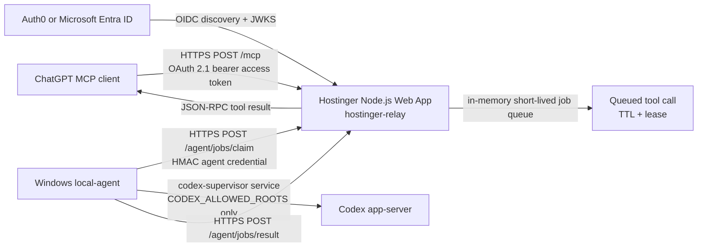

# Hostinger Relay Deployment

This deployment exposes the remote MCP endpoint at:

```text
https://mcp.biotele.mx/mcp
```

DNS and hosting stay at Hostinger. Do not use Cloudflare, do not open router
ports, and do not expose the Windows machine directly.

## Architecture



The Hostinger app validates OAuth bearer JWTs for ChatGPT-facing `/mcp`
requests, validates HMAC signatures only for local-agent routes, rate-limits,
queues work, and returns completed tool results. It never starts Codex, never
reads repositories, and never accesses Windows files.

The Windows local-agent never listens on a port. It connects outbound only to
`https://mcp.biotele.mx`, validates requested `cwd` values against
`CODEX_ALLOWED_ROOTS`, invokes the existing supervisor service, then uploads
results or errors.

## Components

- `src/hostinger-relay.mjs`: Hostinger Node.js Web App entrypoint.
- `src/local-agent.mjs`: outbound-only Windows worker.
- `src/oauth-resource-server.mjs`: OAuth bearer JWT validation, OIDC discovery,
  JWKS caching, and protected-resource metadata.
- `src/relay-auth.mjs`: agent-only HMAC signing, timestamp, nonce, and expiry checks.
- `src/relay-queue.mjs`: short-lived in-memory queue with leases.
- `scripts/install-local-agent.ps1`: Windows user-environment and scheduled-task helper.
- `scripts/McpServerLauncher.cs`: hidden native `MCP Server.exe` task launcher.
- `scripts/McpServerIcon.png.base64`: reproducible, hash-pinned launcher icon source.

## Hostinger hPanel Deployment

1. In Hostinger hPanel, create or select the hosting plan for `biotele.mx`.
2. Open `Websites` > `biotele.mx` > `Advanced` > `Node.js`.
3. Create a new Node.js application for the MCP subdomain, not the existing
   public website path.
4. Choose Node.js `22` or `24`.
5. Set the startup command to:

```text
npm run start:hostinger-relay
```

6. Set the app root to the deployed repository directory.
7. Add the environment variables listed below in hPanel. Store real secrets only
   in Hostinger environment variables.
8. Deploy from GitHub using Hostinger's Git integration, or upload the checked
   repository contents. Do not include `.env` files.
9. Start or restart the Node.js application.
10. Confirm health from a browser or terminal:

```text
https://mcp.biotele.mx/healthz
```

Expected response:

```json
{"status":"ok"}
```

## DNS

In Hostinger DNS Zone Editor for `biotele.mx`, add:

```text
Type: CNAME
Name: mcp
Target: the Hostinger Node.js app hostname shown in hPanel
TTL: default
```

If hPanel assigns an A record target instead of a CNAME target, use the exact A
record value Hostinger provides. Keep the existing `biotele.mx` website records
unchanged.

Use Hostinger-managed HTTPS for `mcp.biotele.mx`. Wait for the certificate to
show as active before connecting MCP clients.

## Hostinger Environment Variables

Use `examples/hostinger-relay.env.example` as a placeholder-only template.

```text
NODE_ENV=production
PORT=<provided by Hostinger, or 3000 if hPanel asks for one>
BIOTELE_RELAY_AGENT_KEY_ID=windows-agent-1
BIOTELE_RELAY_AGENT_SECRET=<different 32+ byte agent secret>
BIOTELE_RELAY_PUBLIC_URL=https://mcp.biotele.mx
BIOTELE_RELAY_TRUST_PROXY=true
BIOTELE_RELAY_OAUTH_REQUIRED=true
BIOTELE_RELAY_OAUTH_ISSUER=<issuer URL from Auth0 or Entra ID>
BIOTELE_RELAY_OAUTH_AUDIENCE=https://mcp.biotele.mx/mcp
BIOTELE_RELAY_OAUTH_JWKS_CACHE_MS=600000
BIOTELE_RELAY_OAUTH_CLOCK_SKEW_SECONDS=60
BIOTELE_RELAY_OAUTH_READ_SCOPE=biotele.mcp.read
BIOTELE_RELAY_OAUTH_WRITE_SCOPE=biotele.mcp.write
BIOTELE_RELAY_MAX_BODY_BYTES=262144
BIOTELE_RELAY_MAX_RESULT_BYTES=2097152
BIOTELE_RELAY_IDEMPOTENCY_MAX_BYTES=33554432
BIOTELE_RELAY_RATE_LIMIT_PER_MINUTE=120
BIOTELE_RELAY_RESULT_RATE_LIMIT_PER_MINUTE=600
BIOTELE_RELAY_MCP_WAIT_MS=55000
BIOTELE_RELAY_AGENT_POLL_MS=25000
BIOTELE_RELAY_JOB_TTL_MS=120000
BIOTELE_RELAY_JOB_LEASE_MS=60000
BIOTELE_RELAY_MAX_QUEUED_JOBS=200
BIOTELE_RELAY_MONITOR_ENABLED=true
BIOTELE_RELAY_MONITOR_INTERVAL_MS=60000
BIOTELE_RELAY_MONITOR_FAILURE_THRESHOLD=2
BIOTELE_RELAY_MONITOR_ALERT_COOLDOWN_MS=300000
BIOTELE_RELAY_MONITOR_QUEUE_WARNING_THRESHOLD=160
BIOTELE_RELAY_MONITOR_AGENT_STALE_MS=120000
BIOTELE_RELAY_MONITOR_WEBHOOK_URL=<optional HTTPS alert webhook URL>
BIOTELE_RELAY_MONITOR_WEBHOOK_TIMEOUT_MS=10000
```

`BIOTELE_RELAY_IDEMPOTENCY_MAX_BYTES` bounds retained settled tool outcomes. It
must be at least `BIOTELE_RELAY_MAX_RESULT_BYTES` and must reserve 512 bytes for
each `BIOTELE_RELAY_MAX_QUEUED_JOBS` entry so replay-sensitive tombstones remain
fail-closed for the configured job TTL.

Do not set `BIOTELE_RELAY_CLIENT_KEYS` for ChatGPT. The public MCP endpoint
uses OAuth bearer access tokens only. Agent HMAC credentials are separate and
valid only on `/agent/jobs/claim`, `/agent/jobs/result`, and `/agent/status`.
Prefer the split `BIOTELE_RELAY_AGENT_KEY_ID` and `BIOTELE_RELAY_AGENT_SECRET`
variables on Hostinger because some hPanel fields normalize JSON-shaped values.
If hPanel retains only `BIOTELE_RELAY_AGENT_KEYS`, set that variable to the raw
canonical Base64 agent secret with no JSON, quotes, braces, or backslashes. The
relay then uses `windows-agent-1` as the key ID. This single-secret format must
decode to at least 32 bytes and is intended for one Hostinger-connected agent.
`BIOTELE_RELAY_TRUST_PROXY=true` is appropriate only while the app is reachable
through Hostinger's managed reverse proxy and the direct origin is not publicly
reachable. The relay then uses the nearest proxy-supplied `X-Forwarded-For`
address for pre-authentication failure buckets, preventing one anonymous client
from poisoning the valid Windows agent's shared proxy-socket bucket.

## Relay Health Monitoring

The relay exposes:

- `/healthz`: lightweight process health.
- `/readyz`: startup readiness.
- `/monitorz`: non-secret monitor snapshot for readiness, queue pressure, and
  local-agent heartbeat freshness.

The in-process monitor is enabled by default. It checks the relay every
`BIOTELE_RELAY_MONITOR_INTERVAL_MS`, writes failure alerts to stderr after
`BIOTELE_RELAY_MONITOR_FAILURE_THRESHOLD` consecutive failures, and rate-limits
repeat alerts with `BIOTELE_RELAY_MONITOR_ALERT_COOLDOWN_MS`. Set
`BIOTELE_RELAY_MONITOR_WEBHOOK_URL` to send the same non-secret alert payload to
an HTTPS alert receiver. Do not log or commit webhook URLs; store them only as
Hostinger environment variables.

Set `BIOTELE_RELAY_MONITOR_QUEUE_WARNING_THRESHOLD` below
`BIOTELE_RELAY_MAX_QUEUED_JOBS` to alert before queue saturation. Set
`BIOTELE_RELAY_MONITOR_AGENT_STALE_MS` to alert when no authenticated local-agent
request has reached the relay recently. Leave either value unset to disable that
specific check.

## Local Agent Installation

On the Windows machine that can run Codex:

```powershell
Set-Location -LiteralPath 'C:\Users\Red Mex\Documents\codex-supervisor-mcp'
npm install
.\scripts\install-local-agent.ps1 `
  -RelayBaseUrl 'https://mcp.biotele.mx' `
  -AgentKeyId 'windows-agent-1' `
  -AllowedRoots 'C:\Users\Red Mex\Documents\codex-supervisor-mcp;C:\Users\Red Mex\Desktop\VitalsScan-Codex-Handoff' `
  -RegisterScheduledTask
```

The installer reuses a valid stored HMAC secret or prompts without echoing it,
discovers and persists the native `codex.exe`, preserves stored allowed roots
when `-AllowedRoots` is omitted, and optionally registers a least-privilege
logon scheduled task. Its dedicated app-server arguments set
`approvals_reviewer="user"`, so approval requests remain available for explicit
supervisor decisions instead of being routed to automatic review. It rejects
`.cmd`, `.bat`, and `.ps1` Codex shims and does not execute an auto-discovered
binary during installation. It does not put the secret in the task command. If
Windows denies scheduled-task registration,
rerun the installer from an Administrator PowerShell. The registered task still
uses the `Limited` run level, is scoped to the current qualified Windows
identity, runs without the default 72-hour execution cutoff, and is allowed to
continue on battery power. It starts when available and restarts up to three
times at one-minute intervals if the local-agent process exits. Allowed roots
must already exist; blank or non-filesystem roots are rejected before settings
are written.

The installer builds `%LOCALAPPDATA%\Biotele Codex MCP\MCP Server.exe` with the
approved Biotele icon and registers that executable directly as the task action.
There is no persistent PowerShell parent. The launcher reads only the required
Biotele and Codex variable names from the current user's `HKCU\Environment`,
copies their values into its own process without logging them, and starts the
Node local-agent with no window. Node is assigned to a Windows job object with
kill-on-close enabled, so stopping the scheduled task terminates the launcher
and its Node child together. The launcher remains outbound-only and does not
listen on a local port.

Manual start:

```powershell
$launcher = Join-Path $env:LOCALAPPDATA 'Biotele Codex MCP\MCP Server.exe'
& $launcher `
  (Get-Command node.exe -CommandType Application).Source `
  (Resolve-Path '.\src\local-agent.mjs').ProviderPath `
  (Get-Location).ProviderPath
```

Scheduled task operations:

```powershell
Start-ScheduledTask -TaskName 'Biotele Codex MCP Local Agent'
Get-ScheduledTask -TaskName 'Biotele Codex MCP Local Agent'
Get-ScheduledTaskInfo -TaskName 'Biotele Codex MCP Local Agent'
Unregister-ScheduledTask -TaskName 'Biotele Codex MCP Local Agent'
```

Keep `CODEX_ALLOW_NETWORK=0` unless a specific supervised task explicitly needs
network access and you are ready to approve that risk. The local-agent rejects
`danger-full-access`.

## MCP Client Authentication

Every `/mcp` request must include:

```text
Authorization: Bearer <OAuth access token>
```

The relay validates RS256 JWT access tokens against the configured issuer,
audience, expiration, not-before, and JWKS signing key. OIDC discovery and JWKS
fetches are timeout-bound and cached. Unknown key IDs trigger one JWKS refresh.
Access tokens are never logged.

The OAuth protected-resource metadata endpoint is:

```text
https://mcp.biotele.mx/.well-known/oauth-protected-resource
```

Unauthenticated `/mcp` requests return `401` with a `WWW-Authenticate` header
that points clients to that metadata endpoint.

Tool authorization is scope based:

```text
Read scope:  biotele.mcp.read
Write scope: biotele.mcp.write
```

Read-only tools require the read scope:

```text
codex_status
codex_wait
codex_list_threads
codex_read_thread
codex_list_approvals
```

Action tools require the write scope:

```text
codex_start
codex_send
codex_steer
codex_interrupt
codex_resolve_approval
```

If the expected `scope` or `scp` claim is absent, the relay fails closed with a
JSON-RPC authorization error.

### ChatGPT web connector setup

Use the production relay, not the loopback `remote-server.mjs` endpoint:

```text
Display name: Biotele Codex Supervisor
MCP URL:      https://mcp.biotele.mx/mcp
Read scope:   biotele.mcp.read
Write scope:  biotele.mcp.write
```

1. In ChatGPT, open **Settings → Apps → Advanced settings** and enable developer
   mode if custom app creation is not already available.
2. Open **Settings → Apps → Connectors** (or
   `https://chatgpt.com/apps#settings/Connectors`) and choose **Create app**.
3. Enter the display name and MCP URL above, select OAuth, and complete the
   Auth0 authorization flow. Never paste an access token into a chat.
4. Start a chat, choose **Add files and more**, and select
   **Biotele Codex Supervisor**. In the standard Chat surface this may appear as
   an inline app mention in the composer.
5. Begin with a read-only call such as `codex_list_threads` and confirm the
   returned allowed roots. Use `codex_start`, then `codex_wait` or
   `codex_status`, for actual work.
6. ChatGPT asks before selected action tools. Inspect the summarized tool input
   and use **Allow once** unless a broader permission is intentionally desired.

If a conversation can still list the tool names but reports that a deferred
tool binding is unavailable, explicitly attach the app again in the next
prompt. If that does not restore the binding, start a standard Chat conversation
and attach the app there. A Work-usage or credit banner is a ChatGPT account
billing boundary, not evidence that the relay or Windows agent is unhealthy.

Reauthenticate the connector only when `/mcp` returns `401`, the OAuth consent
is missing, or the required scopes changed. After reconnecting, verify
`codex_list_threads`, `codex_list_approvals`, and—after explicit approval—one
disposable write-scoped `codex_start`/`codex_wait` round trip before allowing
production work.

## Agent Authentication

Only local-agent routes use HMAC:

```text
/agent/jobs/claim
/agent/jobs/result
/agent/status
/agent/monitor/test-alert
```

The signature covers method, path, timestamp, nonce, expiry, and SHA-256 body
hash. Reused nonces are rejected until the replay window expires. Expired
requests are rejected. OAuth bearer tokens are not accepted on agent routes,
and agent HMAC credentials are not accepted on `/mcp`.

`/agent/monitor/test-alert` sends one synthetic monitor alert through the
configured webhook without changing relay readiness, queue state, Codex task
state, or local-agent polling behavior. It requires the same agent HMAC
signature as the polling routes and is intended for deployment verification
after `BIOTELE_RELAY_MONITOR_WEBHOOK_URL` is configured. If no webhook URL is
configured, the route returns an accepted response with `webhook_not_configured`
and does not make an outbound request.

## MCP Transport

The relay preserves Streamable HTTP-style JSON-RPC over HTTPS for:

```text
initialize
ping
tools/list
tools/call
notifications/*
```

Notifications without an `id` receive `202 Accepted`. JSON-RPC request errors
return structured JSON-RPC error objects where possible. Tool calls are held for
at most `BIOTELE_RELAY_MCP_WAIT_MS`; if the local agent does not finish in that
request window, the result is an MCP tool error indicating timeout. For long
Codex work, call `codex_start`, then poll with `codex_wait` or `codex_status`.
`codex_read_thread` omits full turns by default; request `includeTurns=true`
only when the larger persisted history is required.

The relay negotiates unsupported legacy protocol requests to its supported
fallback and returns `Mcp-Session-Id` from `initialize`. Subsequent MCP requests
must return that visible-ASCII session header with the same OAuth subject. Issued
sessions use a bounded registry and a sliding 24-hour lifetime. Identical
`tools/call` retries with the same OAuth subject, MCP session, typed JSON-RPC id,
and canonical request hash share one in-flight job and a bounded cached result.
Reusing that identity with a different payload fails with JSON-RPC `-32009`.
`DELETE /mcp` validates ownership, terminates the session, and invalidates or
cancels its cached and pending work. If every client waiting for a shared call
disconnects, the queued or leased job is cancelled and late claims or results
are rejected.

The relay advertises `base64url-json-chunked-v1` to updated agents. Each result
is serialized once, SHA-256 hashed, split into bounded chunks, and carried in
the existing HMAC-signed `/agent/jobs/result` requests. The relay verifies the
current job lease before buffering, rejects conflicting or out-of-order chunks,
checks the final byte length and digest, and only then parses the JSON result.
Transient chunk failures retry immediately with the same upload identifier, and
an unexpected HTTP 413 causes a smaller fresh upload. Confirmed local results
are removed from the retry cache; ambiguous failures remain in a byte- and
entry-bounded cache. Legacy one-shot submissions remain accepted for staged
upgrades and obey the same result-size and payload-shape policy. Base64url is
transport encoding, not encryption; decoded results still exist briefly in
relay memory and in the authenticated MCP response. Chunk traffic has its own
authenticated rate budget so near-limit results do not consume the control-call
budget. Failed authentication and malformed result requests remain subject to
the smaller control-call budget before the larger authenticated budget applies.
Tool results larger than 16 KiB keep their exact `structuredContent` but use a
small descriptive text block, preventing the direct STDIO, loopback, and local
agent transports from serializing the same large output twice.
Paginated transcript and bounded status responses report
`responseByteBasis=modern-complete-mcp-envelope`; `responseBytes` measures that
complete transport envelope and may not exceed 1,500,000 bytes. The legacy
envelope is smaller but is checked by the regression suite as well.
The installed Codex app-server currently rejects the schema-advertised
`thread/items/list` method with JSON-RPC `-32601`. Transcript snapshots and
compact status therefore use only `thread/turns/list`: one full head turn for
snapshot provenance, and sequential one-turn metadata pages with exact
backwards-cursor hydration for completed status candidates.
The relay sends a relative result budget with each claim; the agent anchors it
to its own clock so ordinary Hostinger/Windows clock skew cannot invalidate a
fresh lease.

## Threat Model

Protected assets:

- Windows repositories under `CODEX_ALLOWED_ROOTS`.
- Codex app-server access and approvals.
- OAuth access tokens and identity-provider configuration.
- Windows local-agent credential.
- Tool-call prompts and results.

Primary mitigations:

- Hostinger relay has no Codex binary, no repository access, and no inbound path
  to the Windows machine.
- OAuth credentials are accepted only on `/mcp`; agent HMAC keys are accepted
  only on `/agent/*`.
- Read and write scopes split passive status/list calls from action tools.
- Timestamp, nonce, and expiry checks reject replayed or stale requests.
- Jobs are in memory only and short-lived; sensitive payloads are not persisted
  at rest by the relay.
- The queue binds leases to the authenticated agent identity, rejects elapsed
  leases, and requires the lease window to be at least the MCP request window.
- A replay-sensitive write re-delivered without a cached outcome fails closed
  instead of running `codex_start`, `codex_send`, `codex_steer`, or approval
  resolution twice; `codex_interrupt` is covered too because an omitted turn ID
  would otherwise target whichever turn is active during replay. A new
  replay-sensitive operation is also refused when too little result budget
  remains to execute it and report the outcome safely.
- Result uploads are opaque to intermediary content filters and bounded by
  per-result, per-chunk, aggregate-memory, and expiry limits.
- Settled MCP outcomes use a separate byte-bounded idempotency cache. Large
  read-only outcomes are evicted first; replay-sensitive mutation keys remain
  fail-closed for their TTL even if byte pressure replaces the original outcome
  with a compact tombstone.
- The local-agent validates every requested `cwd` against `CODEX_ALLOWED_ROOTS`.
- The spawned Codex process does not inherit `BIOTELE_*` or `CODEX_REMOTE_*`
  credentials.
- Network access is disabled by default and `danger-full-access` is not
  supported.
- Logs redact common token, key, secret, and bearer patterns.

Remaining risks:

- Hostinger process memory can temporarily contain prompts and results while a
  job is pending.
- A compromised Hostinger environment can enqueue malicious but still
  policy-checked work for the local-agent.
- A compromised local Windows user environment can leak the agent secret.
- Environment stripping prevents accidental child inheritance, but Codex runs
  under the same Windows account. It can still read user-scoped settings if it
  is explicitly directed to do so. Use a dedicated Windows account when the
  child process must be isolated from relay credentials.
- In-memory jobs are lost when Hostinger restarts. A client retry creates a new
  operation and can repeat a write that finished just before the restart; check
  thread/turn state before retrying `codex_start`, `codex_send`, or
  `codex_steer`.
- A misconfigured identity provider can issue overly broad write-capable
  tokens.

## Auth0 Setup

Auth0 is the simpler option for a single-user deployment.

1. Create a Regular Web Application for ChatGPT's OAuth client registration.
2. Create an API for the relay with identifier `https://mcp.biotele.mx/mcp`.
3. Add permissions/scopes:

```text
biotele.mcp.read
biotele.mcp.write
```

4. Configure Authorization Code Flow with PKCE.
5. Add the ChatGPT-provided callback URL to Allowed Callback URLs.
6. Ensure access tokens for the API are RS256 JWTs.
7. Authorize ChatGPT OAuth clients for the relay API's user-delegated
   permissions. Auth0 can dynamically register ChatGPT clients successfully
   while still rejecting authorization with this error if the API access grant
   is missing:

```text
Client "<client_id>" is not authorized to access resource server "https://mcp.biotele.mx/mcp".
```

   For each registered ChatGPT application, open the application in Auth0,
   choose API or Application Access for the relay API, and grant only:

```text
biotele.mcp.read
biotele.mcp.write
```

   For future dynamically registered ChatGPT clients, configure the relay API's
   default third-party application permissions to authorize user-delegated access
   with the same two picked scopes. Keep client-credentials access unauthorized
   unless a separate machine-to-machine client is intentionally introduced.
8. Set Hostinger:

```text
BIOTELE_RELAY_OAUTH_ISSUER=https://YOUR_TENANT.REGION.auth0.com/
BIOTELE_RELAY_OAUTH_AUDIENCE=https://mcp.biotele.mx/mcp
```

9. For single-user use, restrict the Auth0 application or API access to your
   user/account and issue only the scopes you intend ChatGPT to use.

## Microsoft Entra ID Setup

1. In Microsoft Entra admin center, register an application for ChatGPT OAuth.
2. Add the ChatGPT-provided redirect URI as a Web redirect URI.
3. In `Expose an API`, set the Application ID URI or audience expected by the
   relay, for example `https://mcp.biotele.mx/mcp`.
4. Add delegated scopes:

```text
biotele.mcp.read
biotele.mcp.write
```

5. Configure the app to use Authorization Code Flow with PKCE.
6. Confirm access tokens are signed with RS256 and include the configured
   audience plus `scp` claim.
7. Set Hostinger:

```text
BIOTELE_RELAY_OAUTH_ISSUER=https://login.microsoftonline.com/<tenant-id>/v2.0
BIOTELE_RELAY_OAUTH_AUDIENCE=https://mcp.biotele.mx/mcp
```

8. Limit consent and app assignment to the intended user or tenant.

## Verification

When validating a Windows local-agent restart, deploy the current relay build
first. The relay removes an outstanding `/agent/jobs/claim` waiter when that
agent connection disconnects; without that behavior, a job submitted
immediately after restart can be leased to the dead long poll and wait for the
full MCP timeout. After deployment, stop and restart the scheduled task, issue
one immediate read-only status call, and then repeat warm-path samples. Do not
close the cold-start gate based only on warm-path results.

Run the full test suite before deployment:

```powershell
npm test
```

For v1.2.5, deploy and verify the Hostinger relay first. Then run the Windows
installer and restart the scheduled task. This order is rollback-safe because
the new relay accepts both result formats and the new agent uses chunking only
when the relay advertises it.

Relay tests cover authentication, expiry, replay rejection, queue lifecycle,
timeout, duplicate delivery lease rejection, OAuth token validation, scope
authorization, protocol negotiation, subject-bound MCP session lifecycle,
protected-resource metadata, boundary rejection between OAuth and agent HMAC,
synthetic monitor test alerts, result submission, local-agent task restart
settings, native Codex discovery, child-secret isolation, chunked large results,
and a mocked local-agent integration.
